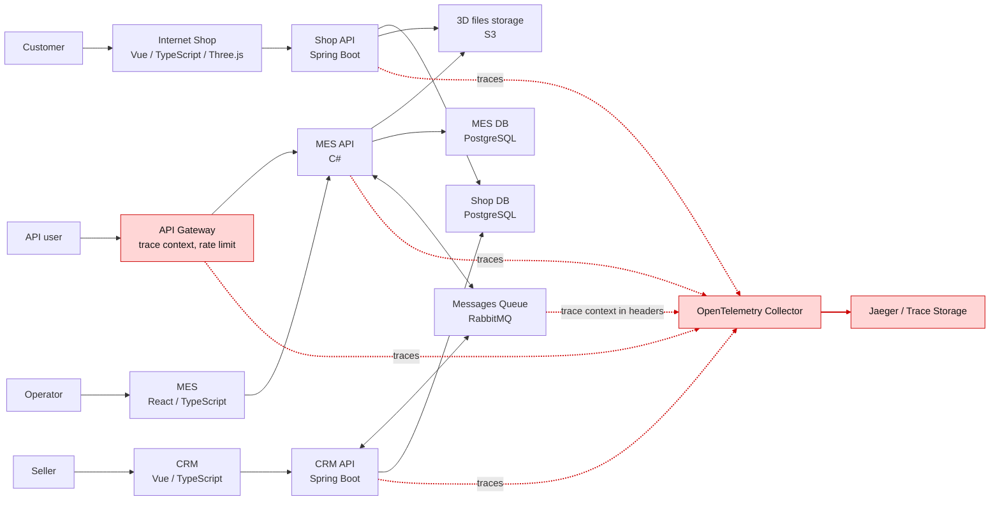
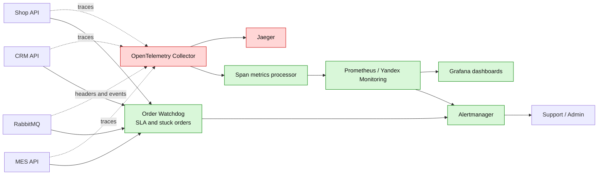

# Архитектурное решение по трейсингу

## Какие системы покрыть трейсингом

Трейсинг нужно внедрять в системах, через которые проходит заказ или событие, влияющее на заказ:

1. Internet Shop UI и Shop API - создание заказа, загрузка 3D-файла, отправка заказа.
2. 3D files storage - загрузка и получение модели для расчета стоимости.
3. MES API - внешний партнерский API, расчет стоимости, операторские действия, смена производственных статусов.
4. MES background workers - если расчет стоимости будет вынесен в отдельные воркеры.
5. CRM API - подтверждение производства, закрытие заказа, обработка сообщений от MES.
6. RabbitMQ - публикация, доставка, ретраи, DLQ для событий заказа.
7. API Gateway - вход партнерских запросов, rate limiting и idempotency.
8. Интеграции транспортной компании - событие получения/доставки, после которого CRM закрывает заказ.

Места, где заказ может "сломаться" или зависнуть:

1. Пользователь загрузил 3D-файл, но Shop API не сохранил корректную ссылку на S3-объект.
2. Заказ перешел в `SUBMITTED`, но событие для MES не опубликовано или не доставлено.
3. MES начал расчет стоимости, но расчет завис на сложной модели или завершился ошибкой без понятного статуса.
4. MES посчитал цену, но событие `PRICE_CALCULATED` не дошло до CRM.
5. CRM создала или подтвердила заказ, но событие для MES потерялось, продублировалось или обработалось неидемпотентно.
6. Оператор взял заказ, но смена статуса `MANUFACTURING_STARTED` не записалась в MES DB или не попала в очередь.
7. `MANUFACTURING_COMPLETED`, `PACKAGING`, `SHIPPED`, `CLOSED` не синхронизировались между системами.
8. Сообщение попало в DLQ, но команда не получила алерт и не выполнила reprocess.

## Данные, которые должны попадать в трейсинг

Обязательные технические поля:

1. `trace_id`, `span_id`, `parent_span_id`.
2. `correlation_id` - единый идентификатор бизнес-операции заказа.
3. `order_id` - бизнес-идентификатор заказа. Используется как attribute в trace, но не как label в метриках.
4. `idempotency_key` - для внешних API и сообщений.
5. `service.name`, `service.version`, `deployment.environment`.
6. HTTP: `method`, `route`, `status_code`, `client_type`, `partner_id`.
7. RabbitMQ: `exchange`, `routing_key`, `queue`, `message_id`, `message_type`, `attempt`, `retry_count`.
8. БД: тип операции, таблица/репозиторий, длительность, результат. SQL с персональными данными не писать.
9. Ошибки: `exception.type`, `exception.message`, `error.code`, stack trace для backend.

Обязательные бизнес-поля:

1. Текущий статус заказа и целевой статус перехода.
2. Источник заказа: `b2c`, `partner`, `crm_manual`.
3. Тип операции: `order_created`, `file_uploaded`, `price_calculation_started`, `price_calculated`, `manufacturing_approved`, `status_changed`, `order_closed`.
4. Параметры модели без чувствительных данных: `file_id`, `file_size_bucket`, `polygon_count_bucket`, `model_complexity_bucket`.
5. Длительность расчета стоимости и ожидания в очереди.
6. Признак ручного вмешательства: `manual_override=true|false`.

Персональные данные клиентов, телефон, email, адрес доставки, платежные данные и содержимое 3D-файла в трейсинг не пишутся.

## Мотивация

Трейсинг нужен, чтобы команда могла ответить на вопросы:

1. Где конкретный заказ находится сейчас?
2. Какой сервис последним успешно обработал заказ?
3. Какое сообщение не дошло или упало?
4. Что заняло больше всего времени: API, очередь, расчет, БД или ручной этап?
5. Сколько заказов затронуты похожим сбоем?

Влияние на технические и бизнес-метрики:

1. MTTR инцидентов по заказам должен снизиться, потому что путь заказа будет виден по `trace_id`/`order_id`.
2. Доля заказов с неизвестным состоянием должна стремиться к нулю.
3. Среднее время расчета цены и ожидания в очереди станет измеримым, значит его можно оптимизировать.
4. Количество ручных обращений партнеров и клиентов в поддержку должно снизиться.
5. Процент заказов, выполненных в обещанные три недели, должен вырасти благодаря раннему обнаружению зависаний.

## Предлагаемое решение

### Технологии

1. OpenTelemetry как единый стандарт инструментации.
2. OpenTelemetry Collector как точка приема traces от Java Spring Boot, .NET/C# MES и будущих воркеров.
3. Jaeger для MVP и расследования отдельных трасс. Для production можно рассмотреть Grafana Tempo, если уже используется Grafana/Prometheus.
4. W3C Trace Context (`traceparent`, `tracestate`) для HTTP.
5. Передача trace context через RabbitMQ headers для асинхронных сообщений.
6. Для Java Spring Boot - OpenTelemetry Java Agent или Spring Boot Actuator + Micrometer Tracing.
7. Для MES на C# - OpenTelemetry .NET SDK в ASP.NET Core и `System.Diagnostics.ActivitySource` для бизнес-спанов.
8. Для новых сервисов и воркеров - .NET 8, ASP.NET Core, C#.

### Правила внедрения

1. Входной API Gateway создает или принимает `correlation_id` и `traceparent`.
2. Каждый backend прокидывает `traceparent` во все HTTP-вызовы.
3. Publisher в RabbitMQ записывает `traceparent`, `tracestate`, `correlation_id`, `order_id`, `message_id` в headers.
4. Consumer восстанавливает trace context из headers и создает child span для обработки сообщения.
5. Вокруг ключевых бизнес-операций создаются ручные spans: расчет цены, смена статуса, публикация события, запись в БД, reprocess.
6. Sampling: 100% ошибок, 100% долгих операций сверх SLO, 100% заказов крупных партнеров в период стабилизации, остальное - адаптивно 5-20%.
7. Поиск трассы должен быть возможен по `order_id`, `correlation_id`, `partner_id`, `message_id`.

### Схема с новыми компонентами трейсинга

Ссылка на исходную диаграмму контейнеров: https://code.s3.yandex.net/software-architect/jewerly_c4_model.drawio?etag=3fd9b7afd2890dfd40ae2217e418e9fa

Ниже приведена доработанная схема. Красным выделены новые компоненты и связи для трейсинга.



### Автоматический мониторинг процесса заказа и алертинг

Из трейсинга нужно получать агрегаты:

1. latency по сервисам и endpoint-ам;
2. service graph;
3. длительность бизнес-спанов `price_calculation`, `status_transition`, `message_processing`;
4. количество traces с ошибками;
5. заказы, у которых нет ожидаемого следующего события дольше SLA.

Для этого OpenTelemetry Collector дополняется `spanmetrics` processor, который пишет агрегаты в Prometheus. Отдельный Order Watchdog читает события статусов из БД/очереди и сверяет их с SLA. При нарушении создает алерт в Alertmanager и тикет для поддержки.

Зеленым выделены дополнительные компоненты автоматического мониторинга и алертинга.



### MVP для задания 3.1

В папке `Task3` добавлен минимальный MVP:

1. `services/service-a` - ASP.NET Core .NET 8 сервис с одним `GET /`. Он создает бизнес-span и вызывает `service-b`.
2. `services/service-b` - ASP.NET Core .NET 8 сервис с одним `GET /`. Он возвращает результат расчета и добавляет attributes в текущий span.
3. `k8s/jaeger-instance.yaml` - Jaeger all-in-one с включенным OTLP.
4. `k8s/services.yaml` - Kubernetes Deployment/Service для `service-a` и `service-b`.

Команды для запуска в Minikube:

```bash
minikube start --addons=ingress
kubectl apply -f https://github.com/cert-manager/cert-manager/releases/download/v1.13.3/cert-manager.yaml
kubectl create namespace observability
kubectl create -f https://github.com/jaegertracing/jaeger-operator/releases/download/v1.51.0/jaeger-operator.yaml -n observability
kubectl apply -f Task3/k8s/jaeger-instance.yaml
minikube image build -t service-a:latest Task3/services/service-a/
minikube image build -t service-b:latest Task3/services/service-b/
kubectl apply -f Task3/k8s/services.yaml
kubectl exec -it $(kubectl get pods -l app=service-a -o jsonpath='{.items[0].metadata.name}') -- wget -qO- http://service-a:8080
kubectl port-forward svc/simplest-query 16686:16686
```

После этого Jaeger UI доступен по адресу http://localhost:16686. В текущей рабочей среде Docker Desktop не запущен и `kubectl` не имеет current context, поэтому фактический скриншот трассы здесь не создан.

## Компромиссы

1. Трейсинг не восстановит историю старых заказов, которые прошли до внедрения instrumentation.
2. Если не прокидывать context через RabbitMQ headers, асинхронные участки будут разорваны на отдельные traces.
3. Высокая детализация и 100% sampling на всем трафике могут быть дорогими по storage и CPU.
4. Трейсинг не заменяет бизнес-журнал статусов. Для юридически и операционно значимой истории нужен отдельный audit/event log.
5. Не все frontend-действия нужно трассировать сразу. На первом этапе важнее backend и очередь.
6. Если часть кода MES сложна для изменения, можно начать с auto instrumentation и добавить ручные spans только в критичных местах.
7. Для поиска по конкретному заказу нужен баланс: `order_id` полезен для расследования, но его нельзя превращать в высококардинальную метрику.

## Безопасность

1. Jaeger/Grafana доступны только из внутренней сети, VPN или через корпоративный SSO.
2. Роли доступа: `Support` - просмотр traces по заказам; `Developer` - просмотр технических details; `Admin` - управление retention/sampling.
3. В traces запрещено писать персональные данные, платежные данные, адреса доставки, содержимое файлов и секреты.
4. Для `partner_id` и `user_id` использовать технические идентификаторы или хеши.
5. OpenTelemetry Collector принимает данные только от доверенных сервисов. Для production - mTLS между сервисами и collector.
6. Доступ к trace storage аудитируется: кто искал заказ, когда и по какому идентификатору.
7. Retention traces ограничить: например, 7-14 дней для детальных traces и 30-90 дней для агрегированных span metrics.
8. Sampling настраивается централизованно, чтобы случайно не отправить весь production-трафик с чувствительными attributes.
