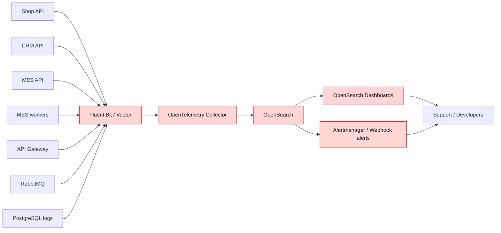

# Архитектурное решение по логированию

## Какие логи собирать

Логи нужно собирать из всех backend-систем, которые участвуют в заказе, а также из инфраструктурных компонентов:

1. Shop API - создание заказа, загрузка 3D-файла, отправка заказа, ошибки интеграции с S3/MES/RabbitMQ.
2. CRM API - создание заказа из сообщения, подтверждение производства, закрытие заказа, ручные действия продавцов.
3. MES API - партнерские запросы, расчет стоимости, действия операторов, смена производственных статусов.
4. MES workers - если расчет стоимости вынесен отдельно.
5. RabbitMQ - publish/consume errors, DLQ, redelivery, consumer disconnects.
6. API Gateway - внешний партнерский трафик, rate limit, authentication/authorization result, idempotency result.
7. PostgreSQL Shop DB и MES DB - slow query logs, connection errors, deadlocks.
8. S3/object storage - ошибки загрузки/чтения 3D-файлов и технические access logs при необходимости.
9. Frontend error logs - только технические ошибки UI без персональных данных, через отдельный endpoint/RUM.

## INFO-логи

INFO-логи должны описывать значимые бизнес- и интеграционные события, а не каждую строку выполнения.

| Событие | Сервис | Поля |
| --- | --- | --- |
| Заказ создан | Shop API / MES API для партнеров | `timestamp`, `level`, `service`, `env`, `order_id`, `correlation_id`, `source`, `partner_id`, `user_id_hash` |
| 3D-файл загружен | Shop API | `order_id`, `file_id`, `file_size`, `content_type`, `s3_bucket`, `duration_ms`, `result` |
| Заказ отправлен на расчет | Shop API / MES API | `order_id`, `message_id`, `exchange`, `routing_key`, `idempotency_key` |
| Расчет стоимости начат | MES API / worker | `order_id`, `calculation_id`, `polygon_count_bucket`, `complexity_bucket`, `queue_wait_ms` |
| Расчет стоимости завершен | MES API / worker | `order_id`, `calculation_id`, `duration_ms`, `price_bucket`, `result` |
| Статус заказа изменен | Shop API / CRM API / MES API | `order_id`, `from_status`, `to_status`, `actor_type`, `actor_id_hash`, `duration_from_previous_status_ms` |
| Сообщение опубликовано | Любой publisher | `order_id`, `message_id`, `message_type`, `exchange`, `routing_key`, `trace_id` |
| Сообщение обработано | Любой consumer | `order_id`, `message_id`, `message_type`, `queue`, `attempt`, `duration_ms`, `result` |
| Сообщение отправлено в DLQ | Consumer/RabbitMQ integration | `order_id`, `message_id`, `queue`, `reason`, `exception_type`, `attempt` |
| Партнерский запрос принят | API Gateway | `partner_id`, `route`, `method`, `status_code`, `rate_limit_bucket`, `idempotency_key` |
| Rate limit сработал | API Gateway | `partner_id`, `route`, `limit`, `current_rate`, `retry_after_seconds` |
| Пользователь открыл MES-дашборд | MES API | `actor_id_hash`, `status_filter`, `page_size`, `sort`, `duration_ms`, `cache_hit` |
| Reprocess выполнен | Admin tool / consumer | `order_id`, `message_id`, `actor_id_hash`, `source_queue`, `result` |

Общий формат должен быть JSON:

```json
{
  "timestamp": "2026-05-28T12:00:00.000Z",
  "level": "INFO",
  "service": "mes-api",
  "env": "prod",
  "trace_id": "4bf92f3577b34da6a3ce929d0e0e4736",
  "correlation_id": "ord-flow-123",
  "order_id": "ORD-123",
  "event": "order_status_changed",
  "from_status": "MANUFACTURING_STARTED",
  "to_status": "MANUFACTURING_COMPLETED",
  "actor_type": "operator",
  "actor_id_hash": "u_73b7",
  "duration_ms": 184
}
```

## Уровни логирования

1. `TRACE` - по умолчанию выключен в production. Использовать временно для локальной диагностики конкретного модуля.
2. `DEBUG` - выключен в production, включается точечно на ограниченное время через конфигурацию для расследования.
3. `INFO` - штатные бизнес-события и важные технические события.
4. `WARN` - нештатная, но восстановимая ситуация: retry, медленный запрос, временная недоступность downstream, rate limit.
5. `ERROR` - операция завершилась ошибкой: HTTP 5xx, неуспешная обработка сообщения, ошибка записи в БД, ошибка расчета.
6. `FATAL`/`CRITICAL` - сервис не может продолжать работу: отказ подключения к БД на старте, невозможность читать конфигурацию, аварийное завершение.

## Мотивация

Централизованное логирование нужно, чтобы команда перестала восстанавливать проблему только со слов клиента. Для поддержки и разработки важно быстро найти заказ, увидеть статусные события, связанные ошибки, сообщения в очередях и действия пользователей.

Метрики, на которые повлияет логирование:

1. MTTR по инцидентам с заказами - должен снизиться за счет поиска по `order_id` и `correlation_id`.
2. Количество обращений, требующих участия разработчика - должно снизиться, потому что support сможет видеть базовую историю заказа.
3. Доля заказов с неизвестной причиной сбоя - должна снизиться.
4. Lead time исправления production-дефектов - снизится, потому что ошибки будут иметь контекст.
5. Количество просроченных заказов - снизится после алертов на аномалии и зависшие статусы.

## Приоритет внедрения логирования и трейсинга

Команда не сможет покрыть все сразу, поэтому порядок такой:

1. MES API и MES workers. Это главный bottleneck: расчет стоимости, операторский дашборд и производственные статусы.
2. RabbitMQ consumers/publishers между MES и CRM. Здесь вероятны потери, дубли и зависания заказов.
3. CRM API. CRM подтверждает производство и закрывает заказ, поэтому важны ручные действия и обработка сообщений.
4. Shop API. Нужны события создания заказа, загрузки файла и перехода в `SUBMITTED`.
5. API Gateway для партнеров. Нужны логи rate limit, idempotency и ошибок контрактов.
6. Frontend error logs. Полезно, но после backend-критичного пути.

Такой порядок выбран потому, что жалобы связаны с заказами, расчетом, MES и партнерским API. UI-ошибки важны, но сейчас меньше влияют на потерю заказов, чем backend pipeline.

## Предлагаемое решение

### Технологии

Рекомендуемое решение: OpenSearch + OpenSearch Dashboards + Fluent Bit/Vector + OpenTelemetry Collector.

Причины выбора:

1. OpenSearch имеет открытое происхождение, хорошо подходит для JSON-логов и полнотекстового поиска.
2. Fluent Bit или Vector легковесно собирают stdout/container/file logs.
3. OpenTelemetry Collector можно использовать как единый слой для traces, metrics и logs.
4. Стек можно развернуть в облаке и затем перенести в Kubernetes без смены подхода.
5. Для команды это дешевле и проще, чем Splunk, и менее рискованно по лицензии, чем современный Elastic Stack.

### Схема сбора логов

Новые компоненты и связи выделены красным.



### Требования к реализации

1. Все сервисы пишут структурированные JSON-логи в stdout или файл, который читает агент.
2. Единый набор полей: `timestamp`, `level`, `service`, `env`, `version`, `trace_id`, `correlation_id`, `order_id`, `event`, `message`.
3. Java Spring Boot: Logback JSON encoder или ECS-compatible JSON layout, MDC для `trace_id`/`correlation_id`.
4. .NET 8/MES: Serilog или встроенный structured logging с enrichers для `TraceId`, `SpanId`, `CorrelationId`.
5. Все ошибки логируются один раз на границе операции, чтобы не создавать шум и дубли.
6. Логи API Gateway и RabbitMQ должны содержать partner/queue context, но без секретов.
7. В dashboard нужны готовые поиски: по `order_id`, по `correlation_id`, по `partner_id`, по `message_id`, по `exception_type`.

## Безопасность логов

1. Запрещено логировать пароль, token, cookie, payment data, email, телефон, адрес доставки, полное имя клиента и содержимое 3D-файла.
2. `user_id`, `operator_id`, `seller_id` хранить как технический идентификатор или хеш.
3. Для персональных данных, если они случайно попали в exception, использовать masking/sanitizing на уровне логгера и collector-а.
4. Доступ по ролям:
   - `Support` - поиск по заказу и просмотр INFO/WARN/ERROR без stack traces с секретами.
   - `Developer` - технические логи и stack traces.
   - `Admin/SRE` - управление retention, индексами и алертами.
5. Доступ к OpenSearch только через SSO/VPN/private network.
6. Включить audit logs для просмотров и изменений в логовой системе.
7. Шифрование in transit и at rest: TLS между агентами/collector/OpenSearch, encrypted disks/snapshots.

## Политика хранения

Индексы разделяются по системе и окружению:

1. `prod-shop-api-logs-*`
2. `prod-crm-api-logs-*`
3. `prod-mes-api-logs-*`
4. `prod-mes-worker-logs-*`
5. `prod-rabbitmq-logs-*`
6. `prod-api-gateway-logs-*`

Retention:

1. `ERROR/WARN` production - 90 дней.
2. `INFO` production - 30 дней.
3. DEBUG-вставки при расследовании - 3-7 дней.
4. dev/release - 7-14 дней.
5. Архив сжатых логов для аудита - до 180 дней, если это нужно юридически и не содержит персональных данных.

Index lifecycle:

1. rollover по размеру 30-50 GB или по дню;
2. hot storage для последних 7 дней;
3. warm/cold storage для более старых логов;
4. лимиты ingest-rate и alert при резком росте объема.

## Система анализа логов

Алертинг:

1. Рост `ERROR` по сервису выше baseline.
2. Любой `order_message_dlq`.
3. Повторяющиеся ошибки расчета стоимости по одному `exception_type`.
4. Рост `429` для партнера - отдельный business alert для product/support.
5. Ошибки смены статуса заказа.
6. Рост `dashboard_load_slow` в MES.

Аномалии:

1. Резкий рост создания заказов: например, x5 к среднему за последние 7 дней или >1000 заказов за минуту.
2. Необычно много заказов от одного партнера.
3. Увеличение доли ошибок в конкретной версии сервиса после релиза.
4. Много повторов одного idempotency key.
5. Рост логов `WARN retry` без роста успешной обработки.

Действия:

1. Создать incident/ticket с ссылкой на запрос в логах.
2. При DDoS/аномальном партнере - включить/ужесточить rate limit в API Gateway.
3. При DLQ - остановить автоматический reprocess до классификации ошибки.
4. При ошибке после релиза - rollback/canary stop.

## Критерии выбора технологии

| Критерий | ELK/Elastic Stack | OpenSearch | Splunk | Grafana Loki |
| --- | --- | --- | --- | --- |
| Лицензия и стоимость | Elastic License, возможны ограничения | Apache 2.0 для OpenSearch, ниже vendor lock-in | Проприетарный и дорогой | OSS/Enterprise, обычно дешевле Splunk |
| Полнотекстовый поиск | Сильный | Сильный | Очень сильный | Ограниченнее, лучше по labels и потокам |
| JSON-структуры и агрегации | Хорошо | Хорошо | Хорошо | Хорошо для простых запросов, сложная аналитика слабее |
| Порог входа команды | Средний | Средний | Ниже для пользователей, выше по стоимости | Ниже, если уже есть Grafana |
| Интеграция с Kubernetes | Хорошо | Хорошо | Хорошо, но платно | Очень хорошо с Grafana stack |
| Стоимость хранения больших объемов | Средняя/высокая | Средняя | Высокая | Низкая/средняя |
| Security/RBAC | Хорошо | Хорошо | Отлично | Зависит от варианта поставки |
| Подход для расследования заказа | Хорошо | Хорошо | Отлично | Достаточно, если запросы простые |

Выбор: OpenSearch. Он дает нужный поиск и агрегации по структурированным JSON-логам, не требует дорогой коммерческой лицензии и хорошо подходит к будущей Kubernetes-архитектуре. Loki можно рассмотреть позже как более дешевое хранилище технических stdout-логов, но для расследования заказов сейчас важнее удобный поиск по полям и агрегации.
