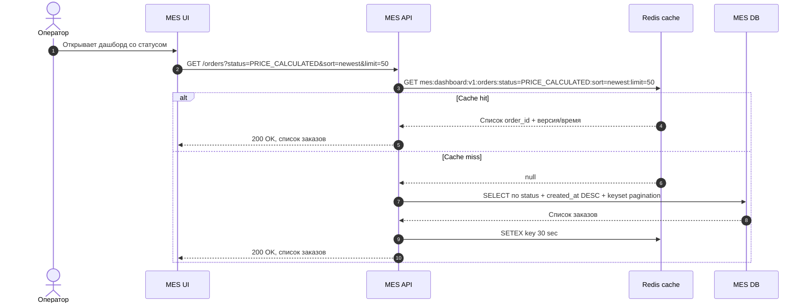

# Архитектурное решение по кешированию

## Мотивация

Главная кандидатура на кеширование - первая страница MES, где операторы видят список заказов в работе по статусам. Даже после фильтра и пагинации страница загружается медленно, а операторам важны самые новые заказы. Это влияет на скорость взятия заказа и на систему вознаграждения.

Кеширование должно решить следующие проблемы:

1. Снизить latency MES-дашборда.
2. Уменьшить нагрузку на MES DB от повторяющихся запросов по статусам.
3. Защитить операторский UI от конкуренции с тяжелым расчетом стоимости.
4. Сохранить корректность статусов: кеш не должен становиться источником истины.

Что включить в кеширование:

1. Список активных заказов для MES-дашборда по статусам: `PRICE_CALCULATED`, `MANUFACTURING_APPROVED`, `MANUFACTURING_STARTED`, `MANUFACTURING_COMPLETED`, `PACKAGING`.
2. Первые страницы сортировки "самые новые", потому что именно они чаще всего нужны операторам.
3. Счетчики заказов по статусам для верхнего блока дашборда.
4. Справочники и неизменяемые данные, если они участвуют в карточке заказа.

Что не кешировать на первом этапе:

1. Сам расчет стоимости 3D-модели как бизнес-результат, если нет строгого способа определить идентичность модели и параметров расчета.
2. Персональные данные клиента.
3. Операции записи и смены статусов как cache-only.

## Предлагаемое решение

### Тип кеширования

Предлагается серверное кеширование на стороне MES API с Redis.

Клиентское кеширование в браузере MES не подходит как основное решение, потому что операторы конкурируют за новые заказы. Браузерный кеш может показать устаревший список и привести к конфликтам "кто первым взял заказ". Клиенту можно добавить только короткое UI-level кеширование на 3-5 секунд для защиты от двойных кликов и повторных refresh, но источник ускорения должен быть на сервере.

### Паттерн кеширования

Основной паттерн: Cache-Aside с программной инвалидацией по событию смены статуса.

Почему Cache-Aside:

1. БД остается источником истины.
2. MES API контролирует ключи и TTL.
3. Если Redis недоступен, система деградирует до чтения из БД.
4. Подходит для read-heavy страницы с повторяющимися фильтрами.
5. Можно внедрить постепенно без полной перестройки записи.

Почему не Write-Through:

1. Запись статуса должна быть атомарной в БД и бизнес-логике, а кеш не должен становиться частью критичной транзакции.
2. Любой сбой Redis не должен блокировать смену производственного статуса.
3. Write-Through увеличит coupling между записью статуса и кешем.

Почему не Refresh-Ahead как основной:

1. Горячие ключи зависят от статуса, страницы, сортировки и активности операторов.
2. Можно зря обновлять данные, которые сейчас никто не читает.
3. Refresh-Ahead полезен позже для счетчиков и первой страницы самых горячих статусов, но после измерения нагрузки.

### Ключи кеша

Примеры ключей:

1. `mes:dashboard:v1:orders:status={status}:sort=newest:limit={limit}:cursor={cursor}`
2. `mes:dashboard:v1:counters`
3. `mes:dashboard:v1:order-card:{order_id}`

TTL:

1. Списки заказов: 15-30 секунд.
2. Счетчики по статусам: 10-15 секунд.
3. Справочники: 5-60 минут в зависимости от частоты изменения.

Короткий TTL нужен из-за конкуренции операторов за новые заказы. Основная корректность обеспечивается не TTL, а инвалидацией при смене статуса.

### Чтение списка заказов



### Запись изменения статуса заказа

```mermaid
sequenceDiagram
    autonumber
    actor Operator as Оператор
    participant MESUI as MES UI
    participant MESAPI as MES API
    participant MESDB as MES DB
    participant Rabbit as RabbitMQ
    participant Redis as Redis cache

    Operator->>MESUI: Берет заказ в работу
    MESUI->>MESAPI: POST /orders/{id}/status MANUFACTURING_STARTED
    MESAPI->>MESDB: BEGIN; проверить допустимый переход; UPDATE order status; INSERT status_event
    MESDB-->>MESAPI: COMMIT OK
    MESAPI->>Rabbit: Publish order.status.changed
    MESAPI->>Redis: DEL ключей списков старого и нового статуса
    MESAPI->>Redis: DEL mes:dashboard:v1:counters
    MESAPI->>Redis: DEL mes:dashboard:v1:order-card:{order_id}
    MESAPI-->>MESUI: 200 OK, новый статус
```

### Стратегия инвалидации

Используется комбинированная стратегия:

1. Программная инвалидация по ключам при смене статуса заказа.
2. Короткий TTL как страховка от пропущенной инвалидации.
3. Версионирование namespace ключей: `mes:dashboard:v1`, чтобы безопасно сбросить кеш после изменения структуры ответа.
4. Опционально pub/sub или событие `order.status.changed` для инвалидации на нескольких инстансах MES API после горизонтального масштабирования.

Почему это подходит:

1. Смена статуса - явное событие, по которому понятно, какие ключи устарели: старый статус, новый статус, счетчики, карточка заказа.
2. Короткий TTL ограничивает риск устаревшего списка даже при сбое Redis DEL.
3. БД остается источником истины, поэтому запись не зависит от кеша.

Почему не только временная инвалидация:

1. Даже 30 секунд могут быть критичны для операторов, которые берут новые заказы.
2. Счетчики и списки будут заметно устаревать при активной работе.

Почему не полная очистка всего кеша:

1. Это вызовет stampede на MES DB при большом количестве операторов.
2. Большинство ключей не связано с конкретным измененным заказом.

Почему не ручная инвалидация:

1. Ручной сброс не решает штатную смену статусов и требует поддержки.

### Сравнение вариантов

| Решение | Плюсы | Минусы | Вывод |
| --- | --- | --- | --- |
| Cache-Aside + Redis + программная инвалидация | Простое внедрение, БД источник истины, graceful degradation, подходит для read-heavy MES | Нужно аккуратно управлять ключами и защищаться от stampede | Лучший вариант для первого этапа |
| Write-Through | Кеш обновляется сразу при записи | Redis становится частью write path, сбой кеша может влиять на запись, выше coupling | Не подходит для критичных статусных операций |
| Refresh-Ahead | Пользователь чаще получает cache hit | Можно обновлять лишние ключи, сложнее предсказать горячие страницы, сложнее реализация | Можно добавить позже для первых страниц и счетчиков |
| Только индексы без кеша | Нет риска устаревшего кеша, проще консистентность | Не снимает повторяющуюся нагрузку и всплески refresh | Нужно сделать обязательно, но вместе с кешем |

## Дополнительные меры производительности

Кеширование не заменяет оптимизацию запросов. Перед включением Redis нужно:

1. Добавить индексы MES DB под запрос дашборда: `(status, created_at DESC, id)` и отдельные индексы для часто используемых фильтров.
2. Перейти с offset pagination на keyset/cursor pagination, чтобы новые страницы не сканировали большой offset.
3. Ограничить page size и набор полей в списке. Детали заказа загружать отдельным endpoint-ом.
4. Вынести расчет стоимости в отдельные worker-ы, чтобы он не конкурировал с API за CPU.
5. Добавить защиту от cache stampede: singleflight/distributed lock на один горячий ключ или probabilistic early expiration.

## Консистентность и конкуренция операторов

Чтобы два оператора не взяли один заказ:

1. Смена статуса должна выполняться атомарно в MES DB с optimistic concurrency: `UPDATE orders SET status = ... WHERE id = ... AND status = expected_status`.
2. Если `rows_affected = 0`, MES API возвращает конфликт `409 Conflict`, UI обновляет карточку.
3. Кеш инвалидируется только после успешного commit.
4. UI может показывать optimistic update, но обязан подтвердить его ответом API.

## План внедрения

1. Измерить p95/p99 текущего дашборда и slow queries.
2. Добавить индексы и keyset pagination.
3. Развернуть Redis managed service или Redis в Kubernetes с persistence, если managed недоступен.
4. Реализовать Cache-Aside в MES API для списков и счетчиков.
5. Добавить программную инвалидацию после смены статуса.
6. Добавить метрики: cache hit ratio, cache miss, Redis latency, invalidation count, dashboard p95.
7. Провести нагрузочный тест: 10x текущих операторских refresh и поток партнерских заказов.
8. Включить feature flag и rollout сначала на release, затем на часть production-пользователей.

## Риски

1. Устаревшие данные в кеше. Митигируется инвалидацией по ключу, коротким TTL и DB concurrency check.
2. Cache stampede при массовой очистке. Митигируется точечной инвалидацией и singleflight.
3. Redis outage. MES API должен читать из БД и логировать degraded mode.
4. Высокая кардинальность ключей из-за произвольных фильтров. На первом этапе кешируются только фиксированные фильтры дашборда.
5. Скрытие проблем БД кешем. Поэтому индексы и slow-query monitoring обязательны до и после кеширования.
